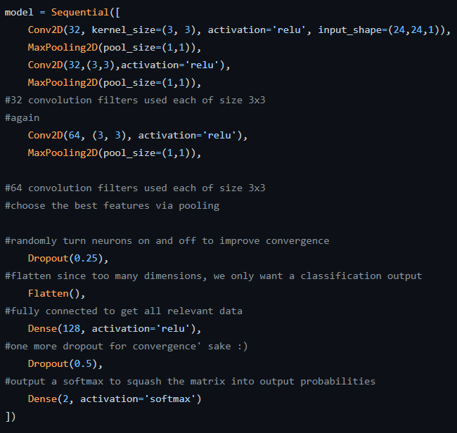

# sleep_detector

**T.C.**

**DOKUZ EYLÜL ÜNİVERSİTESİ**

**YÖNETİM BİLİŞİM SİSTEMLERİ**

**SLEEP DETECTOR**

**YASİN SEVEN**

**2017469044**

**MUHAMMET OĞUZHAN YILMAZ**

**2018469063**

**OĞULCAN GALATA**

**2017469021**

**YAPAY ZEKA**

**DR. KUTAN KORUYAN**

**OCAK 2022**

**PROJENİN AMACI**

Bu projenin amacı, yapay zeka teknikleri kullanılarak kameradan gelen
görüntüdeki insanın gözünün açık ya da kapalı olduğunu tespit eden
sistemi geliştirmektir. Program, ders esnasında veya online sınav
esnasında kullanıcının kim olduğunu tanımlayan ve gözünün kapalı olup
olmadığını tespit ederek, bir metin dosyasına geçmiş kayıtları tutmak
için tasarlanmıştır.

**PROJENİN ÖZETİ**

Bu proje temel olarak iki kısımdan oluşmaktadır. İlk kısımda Kaggle'dan
alınmış yaklaşık 1400 açık ve kapalı göz resmine sahip bir veri seti,
kişinin gözlerinin açık veya kapalı olup olmadığını sınıflandıracak bir
derin öğrenme modelini beslemek için kullanılmıştır. Bu model projenin
ikinci kısmında kullanılmak üzere kaydedilmiştir. İkinci kısımda ise bir
kamera kaydı başlatılarak görüntüdeki kişilerin daha önce tanımlanmış
kişilerden olup olmadığı, kişinin yüzünün ve gözlerinin konumunun anlık
olarak tespit edilmesi daha sonrasında ise kişinin gözlerinin açık ya da
kapalı olup olmadığı tespit edilerek, program sonunda metin dosyasına
aktarılması sağlanmıştır.

**Kaynak kodu:**
[https://github.com/svnyasin/sleep_detector](https://github.com/svnyasin/sleep_detector%20)

**PROJEDE KULLANILAN TEKNOLOJİLER**

**Kullanılan Programlar:** Microsoft Visual Studio Code

**Kullanılan Programlama Dilleri:** Python

**Kullanılan Kütüphaneler:**

-   **face_recognation:** Yüz tanıma işlemini basitleştirmek için
geliştirilmiş bir python kütüphanesi.

-   **Keras:** Neredeyse her tür derin öğrenme modelini tanımlamak ve
eğitmek için uygun bir yol sağlayan Python için bir derin öğrenme
kütüphanesidir. Keras, Tensorflow , Theano ve CNTK üzerinde
çalışabilen Python ile yazılmış bir üst düzey sinir ağları
API'sıdır.

-   **OpenCV:** OpenCV (Open Source Computer Vision) açık kaynak kodlu
görüntü işleme kütüphanesidir.

-   **NumPy:** Python programlama dili için büyük, çok boyutlu dizileri
ve matrisleri destekleyen, bu diziler üzerinde çalışacak üst düzey
matematiksel işlevler ekleyen bir kitaplıktır.

**PROJE YAPIM AŞAMALARI**

**KISIM 1**

**Adım 1:** Dataset %80 train, %20 test olarak tanımlanır. Ve sınıflar
tespit edilir.

**Adım 2:** Kullandığımız model, Evrişimli Sinir Ağları
(CNN) kullanılarak Keras ile oluşturulmuştur. Bir evrişimli sinir ağı,
görüntü sınıflandırma amaçları için son derece iyi performans gösteren
özel bir derin sinir ağı türüdür. Bir CNN temel olarak bir girdi
katmanı, bir çıktı katmanı ve birden çok katmana sahip olabilen bir
gizli katmandan oluşur. Katman ve filtre üzerinde 2B matris çarpımı
gerçekleştiren bir filtre kullanılarak bu katmanlar üzerinde bir
evrişim işlemi gerçekleştirilir. CNN model mimarisi aşağıdaki
katmanlardan oluşur:

-   Evrişimsel katman; 32 düğüm, çekirdek boyutu 3

-   Evrişimsel katman; 32 düğüm, çekirdek boyutu 3

-   Evrişimsel katman; 64 düğüm, çekirdek boyutu 3

-   Tam bağlantılı katman; 128 düğüm

Son katman ayrıca 2 düğümlü tam bağlantılı
bir katmandır. Softmax kullandığımız çıktı katmanı dışındaki tüm
katmanlarda bir Relu aktivasyon işlevi kullanılır.

**Adım 3:** Model derlenir ve eğitim işlemi gerçekleştirilir. Ardından
ikinci kısımda kullanılmak üzere cnnCat2.h5 dosyası olarak kaydedilir.

**KISIM 2**

**Adım 1:** Programın açılış saati loglama işlemi için bir değişkene
atılır.

**Adım 2:** Sağ ve sol gözün tespit edilebilmesi için OpenCV tarafından
daha önceden hazırlanmış XML dosyaları tanımlanır.

**Adım 3:** Kısım 1'de kaydettiğimiz
cnncat2.h5 modelimizi kullanmak üzere tanımlıyoruz. Ve diğer gerekli
değişkenleri tanımlıyoruz

**Adım 4:** Tanınan yüzlerin gelen görüntüde tespit edilebilmesi için
face_recognation kütüphanesi ile kişi resimleri eklenir.

**Adım 5:** Sürekli çalışacak bir döngü başlatılarak, kameradan gelen
her frame için döngü içindeki kodlar çalıştırılır. Gelen framede ilk
olarak yüzün ve gözlerin konumu tespit edilir ve tespit edilen yüzler
tanınan yüzlerle karşılaştırılır eğer tanınmıyorsa 'unknown' olarak
tanımlanır.

**Adım 6:** Tespit edilen yüzlerin ve gözlerin etrafında dikdörtgenler
çizilir ve yüzün altına kişinin kim olduğu yazılır. Yeri tespit edilen
gözlerin kısım 1'de oluşturulan model ile açık mı yoksa kapalı mı
olduğunun tahminlemesi yapılır. Açık ise "1", kapalı ise "0" çıktısı
alınır.

**Adım 7:** Kişinin gözü kapalı ise "score" isimli değişken arttırılmaya
başlanır. Açık ise azaltılır. Eğer "score" 24'ü geçer ise kullanıcının
uyuduğu ya da kopya çektiği varsayılır ve kanıt için resim çekilir.
Burada eşik skorunun 24 verilmesinin sebebi kullanıcıya hata payı
bırakmaktır.

**Adım 8:** Son olarak program kapatılırken sistemin açık kalma
süresinin hesaplanabilmesi için kapanış saati kaydedilir ve gerekli
hesaplamalar yapıldıktan sonra elde edilen bilgiler log dosyasına
yazılarak program sonlandırılır.

**SONUÇ**

Sonuç olarak bu projeyi yaparken bir yapay zeka projesinin bütünüyle
nasıl geliştirilebileceğini bir projenin nasıl planlanabileceğini ve
takım olarak nasıl çalışılabileceğini tecrübe etmiş olduk. Bu proje eğer
gerekli geliştirmeler ve entegrasyon yapılır ise canlı sınav
sistemlerinde kopyayı önlemek için, online ya da yüz yüze olan derslerde
öğrencilerin öğretmeni ne kadar dikkatli dinlediğini ölçmek için veya
uzun yolculuklarda şoförün uyuklama durumunu tespit etmek için
kullanılabilir.